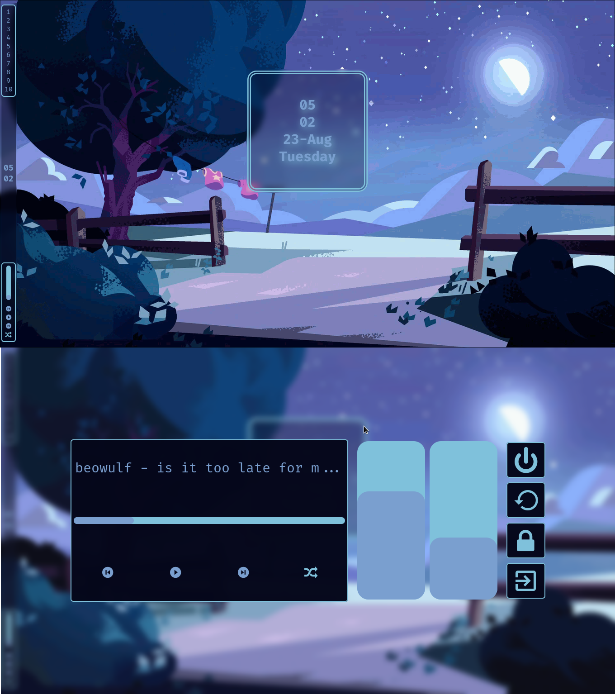

# How install

1. **Step 1:** install dependencies
    - [Hyprland](https://hyprland.org/)
    - [Hyprbars](https://github.com/hyprwm/hyprland-plugins/tree/main/hyprbars)
    - [Eww](https://github.com/elkowar/eww)
    - [Swww](https://github.com/Horus645/swww)
    - [Pywall](https://github.com/dylanaraps/pywal)
    - [Rofi](https://github.com/davatorium/rofi)
    - [Alacritty](https://github.com/alacritty/alacritty)
    - [Ranger](https://github.com/ranger/ranger)

2. **Step 2:** clone the git directory

3. **Step 3:** move to directory

4. **Step 3:** exec `chmod +x install.sh`

5. **Step 4:** run `./install.sh`

## Change the Wallpaper and the colors scheme

Use the script `./.themes/BGChanger.sh (Image dir)`
Display any image in the formats:

- jpeg
- png
- gif
- pnm
- tga
- tiff
- webp
- bmp
- farbfeld
